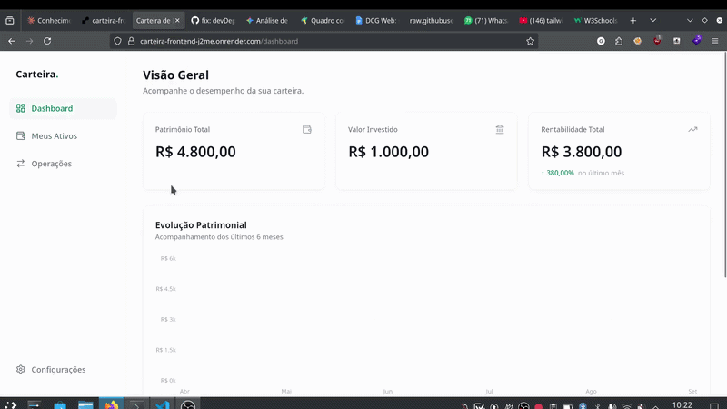

# project2-2026b-guigalmesh
# Projeto: Aplicação com persistência de dados em backend

## Acesso

https://carteira-frontend-j2me.onrender.com/ativos

## Desenvolvedor(a)
Guilherme de Cezaro Martini, Sistemas de Informação

## Proposta
Aplicação web para gerenciar e consolidar uma carteira de investimentos focada no mercado financeiro brasileiro. A plataforma permite cadastrar, consultar, atualizar e excluir operações de compra e venda de ativos (como Ações, FIIs e Renda Fixa), armazenando informações como data da transação, quantidade, valor pago e código do ativo (ticker). O portfólio deve ser visualizado em um dashboard interativo contendo gráficos e tabelas de desempenho, calculando automaticamente o preço médio e a rentabilidade da carteira com base em cotações da bolsa e indicadores econômicos atualizados. Aqui há possibilidade de extensão futura para suportar o mercado global (ações americanas) e criptomoedas.

## Parceria/cliente/usuário
Guilherme Serafini Dapieve

## Feedback/comentário da parceria/cliente/usuário

"Achei a aplicação muito bem construída, com um visual limpo e bem fácil de usar. Todas as funcionalidades pedidas foram cumpridas com sucesso: o cadastro de compra e venda dos ativos, os cálculos de preço médio e rentabilidade ficaram automáticos e precisos, e o dashboard com gráficos mostra o desempenho da carteira de forma bem clara. No geral, o projeto foi bem executado e entrega o que foi proposto."

## Desenvolvimento

### Processo

O desenvolvimento deu bastante trabalho e acredito que teria um resultado melhor com mais prazo.
Demorei bastante tempo para aprender a usar as tecnologias novas que nunca tinha tido contato como React e Node.js, mas acho que foi útil no final pois aprendi bastante e estaria mais confortável em usar nas próximas vezes
Acabei utilizando bastante IA para o desenvolvimento mas acho que o resultado final ficou sólido e funciona bem.
Desde o começo tentei utilizar docker e outras boas práticas e me preocupar bastante em como o deploy seria feito, acho que foi útil já que não tive tanto trabalho assim para fazer o deploy, tirando algum troubleshooting que tive que fazer

### Trechos de código

Reuso de componentes no React e uso do Tailwind:
export function SummaryCard({ title, value, icon, trend }: SummaryCardProps) {
  return (
    

      

        <h3 className="text-sm font-medium">{title}</h3>
        {icon && 
{icon}
}
      

      

        {value}
      

      {trend && (
        

          {trend.isPositive ? '↑' : '↓'}
          {trend.value}
          no último mês
        

      )}
    

  );
}

Gráfico de evolução patrimonial em typescrit:
export async function getEvolucaoPatrimonial(req: Request, res: Response) {
  const usuarioId = getUsuarioId(req);

  try {
    const ativosResult = await pool.query(
      `SELECT DISTINCT o.ativo_id, a.ticker_base
       FROM operacoes o
       JOIN ativos a ON a.id = o.ativo_id
       WHERE o.usuario_id = $1`,
      [usuarioId]
    );

    // 2. Alimenta o banco com o histórico da Brapi (em paralelo para ser rápido)
    await Promise.all(ativosResult.rows.map(a =>
      popularCacheHistorico(a.ativo_id, a.ticker_base)
    ));

    // 3. Gera a lista dos últimos 6 meses
    const meses = [];
    const hoje = new Date();
    for (let i = 5; i >= 0; i--) {
      const d = new Date(hoje.getFullYear(), hoje.getMonth() - i, 1);
      meses.push({
        label: d.toLocaleString('pt-BR', { month: 'short' }).replace('.', ''), // ex: 'set'
        ano: d.getFullYear(),
        mes: d.getMonth() + 1 // 1 a 12
      });
    }

    const graficoData = [];

    // 4. Calcula o património mês a mês
    for (const m of meses) {
      // Pega o último milissegundo do último dia do mês (ex: 30 de Set às 23:59:59)
      const ultimoDia = new Date(m.ano, m.mes, 0, 23, 59, 59).toISOString();

      const query = await pool.query(`
        WITH PosicaoNaData AS (
          SELECT ativo_id, SUM(CASE WHEN tipo = 'COMPRA' THEN quantidade ELSE -quantidade END) as qtd_acumulada
          FROM operacoes
          WHERE usuario_id = $1 AND data_operacao <= $2
          GROUP BY ativo_id
        ),
        PrecoNoMes AS (
          SELECT DISTINCT ON (ativo_id) ativo_id, preco_fechamento
          FROM historico_cotacoes
          WHERE EXTRACT(MONTH FROM data_referencia) = $3 AND EXTRACT(YEAR FROM data_referencia) = $4
          ORDER BY ativo_id, data_referencia DESC
        )
        SELECT p.qtd_acumulada, c.preco_fechamento
        FROM PosicaoNaData p
        JOIN PrecoNoMes c ON c.ativo_id = p.ativo_id
        WHERE p.qtd_acumulada > 0
      `, [usuarioId, ultimoDia, m.mes, m.ano]);

      let patrimonioDoMes = 0;
      for (const row of query.rows) {
         patrimonioDoMes += Number(row.qtd_acumulada) * Number(row.preco_fechamento);
      }

      graficoData.push({
        mes: m.label.charAt(0).toUpperCase() + m.label.slice(1), // Capitaliza (mar -> Mar)
        patrimonio: patrimonioDoMes
      });
    }

    return res.json({ data: graficoData });
  } catch (erro) {
    console.error(erro);
    return res.status(500).json({ error: { codigo: "ERRO_INTERNO", mensagem: "Erro ao gerar gráfico" }});
  }
}

Rotas do backend:
const app = express();
app.use(cors({
  origin: '*',
  methods: ['GET', 'POST', 'PUT', 'DELETE'],
}));
app.use(express.json());

const PORT = process.env.PORT ? Number(process.env.PORT) : 3333;

app.get("/health", (_req, res) => res.json({ status: "ok" }));

app.get("/health/db", async (_req, res) => {
  try {
    const result = await pool.query("SELECT NOW()");
    res.json({ status: "ok", db_time: result.rows[0].now });
  } catch (error) {
    res.status(500).json({ status: "error", message: (error as Error).message });
  }
});

app.use("/api/v1/operacoes", operacoesRouter);
app.use("/api/v1/carteira", carteiraRouter);

app.listen(PORT, '0.0.0.0', () => {
  console.log(`Backend rodando na porta {PORT}`);
});

## Tecnologias

### Linguagens e afins

- Typescript
- Vite
- React
- Postgres
- Docker + Render
- Node.js
- Tailwind

### Ambiente de desenvolvimento

- VSCode
- Gemini
- Claude

## Referências e créditos
React Crash Couse: https://youtu.be/SqcY0GlETPk?si=5k_MN60O4gnTOeYQ
Tailwind em 15 minutos: https://youtu.be/dHwY5lRfkoQ?si=J5xuwRZIiwIvj-JL
https://www.w3schools.com/

---
Projeto entregue para a disciplina de [Desenvolvimento de Software para a Web](http://github.com/andreainfufsm/elc1090-2026b) em 2026b
